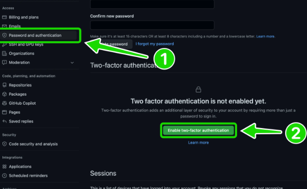
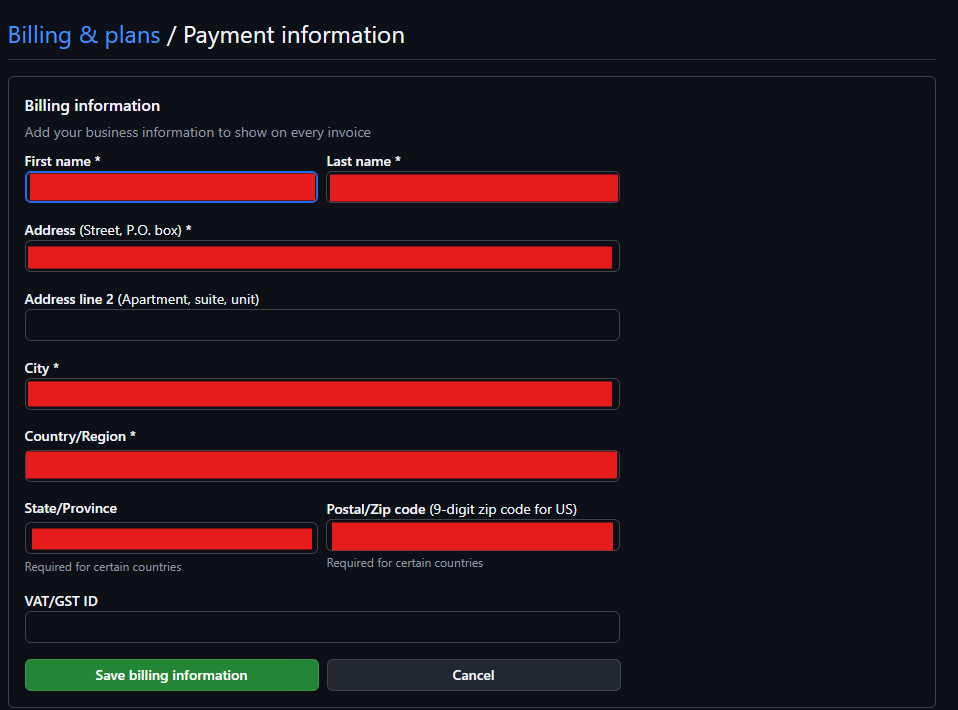
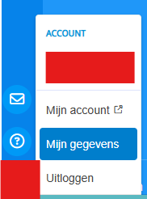
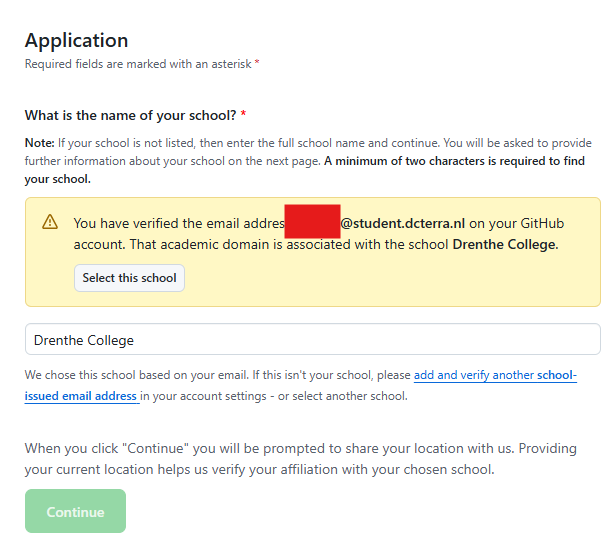

# Hoe krijg je GitHub Education

### Stap 1: Zet 2FA aan op GitHub

Je hebt een authentication app nodig zoals bijvoorbeeld Google Authenticator:

1. Ga naar GitHub en klik op je profielfoto.
2. Ga naar `Settings`.
3. Navigeer naar `Passwords and Authentication`.
4. Klik op `Enable Two-Factor Authentication`.
5. Volg de instructies op het scherm.

---

### Stap 2: Voeg billing informatie toe

1. Ga opnieuw naar je instellingen bij je profielfoto.
2. Open `Billing and Plans`.
3. Klik op `Payment Information`.
4. Vul je echte gegevens in de velden in.
5. Sla de informatie op.

---

### Stap 3: Schooldocument

1. Ga naar Magister.
2. Klik op je profiel foto -> `Mijn Gegevens`.
3. Download je inschrijvingsbevestiging en stuur deze naar je telefoon (bijvoorbeeld via e-mail).

---

### Stap 4: Dien je aanvraag in

1. Ga naar [GitHub Education](https://education.github.com/pack).
2. Klik op `Get Student Benefits` en vul de gevraagde informatie in.
3. Maak een foto van je telefoon waar je het document op open hebt. MOET GOED LEESBAAR ZIJN!!!
4. Dien de aanvraag in. Binnen 8 dagen krijg je een reactie.

---

### Wat krijg je met GitHub Education?

- **Gratis GitHub Pro**, inclusief:
  - GitHub Support via e-mail.
  - 3.000 GitHub Actions-minuten per maand.
  - 2GB GitHub Packages-opslag.
  - Toegang tot geavanceerde repository-inzichten.
  - Toegang tot onbeperkte private repositories.

- **Toegang tot GitHub Copilot**: Een AI-hulp die je helpt bij het schrijven van code.

_Disclaimer: gebruik GitHub Copilot niet om je code volledig te maken. Begrijp wat er gebeurt!_
